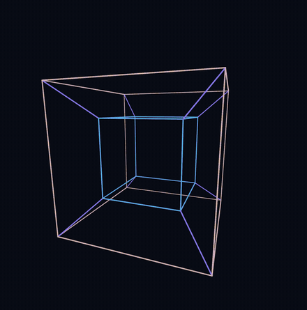
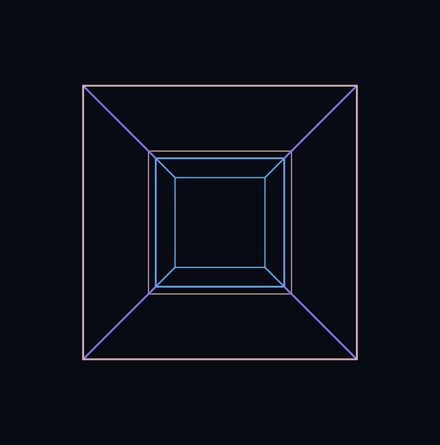
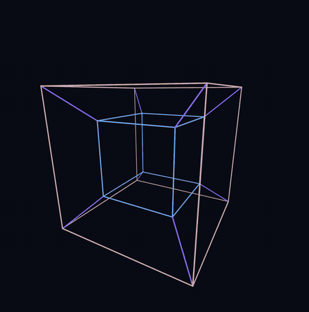
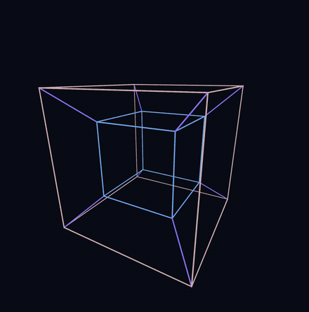
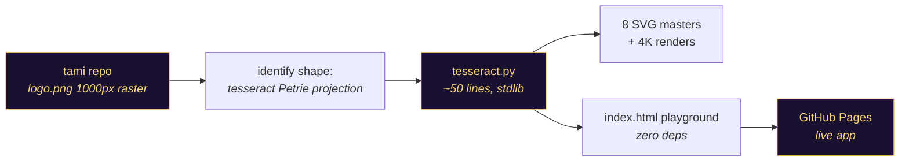

<div align="center">


[](LICENSE)
[](tesseract.py)
[](tesseract.py)
[](index.html)
[](https://tesseract.akeyo.io/4d.html)
[](https://tesseract.akeyo.io/4d.html)
[](https://tesseract.akeyo.io/)
[](https://github.com/fire17/TesseractLogo/stargazers)

<i>A logo you can zoom into forever — because it isn't a picture, it's a theorem.</i>

**[🌀 Motion lab](#-the-motion-lab--watch-the-fourth-dimension)** · **[⚡ Quickstart](#-quickstart)** · **[🎨 Gallery](#-gallery--8-variants)** · **[🕹️ Playground](#%EF%B8%8F-the-playground)** · **[🧮 The math](#-the-math)** · **[🛠️ Making-of](#%EF%B8%8F-making-of)**

</div>

---

## ✨ The part that should stop you

**This mark was never drawn. It is computed.** The star-like logo from [fire17/tami](https://github.com/fire17/tami) is the *Petrie projection of a tesseract* — a real 4-dimensional hypercube flattened onto the page — and this repo regenerates it from first principles instead of upscaling the old 1000px raster:

- The **16 vertices** are every point of `(±1, ±1, ±1, ±1)` in 4D space; the **32 edges** connect pairs differing in exactly one coordinate — [`tesseract.py`](tesseract.py) `assert`s both counts on every run.
- Projection basis: angles `π/8 + i·π/4` — that's the whole trick. Four cosine/sine pairs turn 4D into the octagonal lattice you see.
- The generator is **~50 lines of Python, standard library only**. No numpy, no drawing package, no design tool.
- A vector master is **~7 KB** and stays razor sharp at any size; the original raster was 400 KB and blurry past 1000px.
- Every image in this repo — all 8 variants, the 4K renders, even the banner above — comes out of the same 32-edge computation.

> [!IMPORTANT]
> Change one number in `tesseract.py` and every variant regenerates, pixel-perfect, at any resolution — the logo is source code now.

## ⚡ Quickstart

**Zero-install:** open the live playground → **[tesseract.akeyo.io](https://tesseract.akeyo.io/)** (drag sliders, pick colours, *Save PNG*), or the motion lab → **[tesseract.akeyo.io/4d.html](https://tesseract.akeyo.io/4d.html)** (turn it through the fourth dimension).

Or regenerate every SVG master locally (stdlib only):

```bash
git clone https://github.com/fire17/TesseractLogo && cd TesseractLogo
python3 tesseract.py            # emits all 8 SVG variants into the cwd
# optional 4K raster: brew install librsvg
rsvg-convert -w 4000 -h 4000 tesseract-outlined.svg -o tesseract-4k.png
```

## 🌀 The motion lab — watch the fourth dimension

**[tesseract.akeyo.io/4d.html](https://tesseract.akeyo.io/4d.html)** — the same 32 edges, now turning. Hue encodes the coordinate you can't point at: **cold is far in `w`, gold is near**, so the invisible axis becomes something you can actually watch.

| | |
|---|---|
| <br>**Inside-out** — one turn in the `xw` plane. The inner cube swaps places with the outer. No 3D object can do this. | <br>**Clifford double** — two independent planes turning at once (`xy` and `zw`). Nothing on the shape stands still. |
| <br>**Dalí cross** — the eight cubic cells hinge apart into the net Dalí painted in *Crucifixion*, then close again. | <br>**Long arm on x** — the same fold, but the eighth cell rides out along `x`: a genuinely different net. |

Watch the colours in the unfolding clips: as the solid opens, every hue converges. That isn't a stylistic fade — a finished net lies flat in a single `w`-slice, so the fourth coordinate really has gone.

Drag to turn it in 3D; hold **shift** and drag to turn it *through* `w`. Six rotation planes, a fold slider, six choices of which arm the eighth cell rides out on, and a **Petrie** stop that freezes the whole thing back into the logo at the top of this page.

### Checkpoints — make your own animation

Set the tesseract however you like, press **Save this state** (or `s`), and it becomes a checkpoint with a thumbnail. Save a few, then **Play path** to travel between them — and **Export clip** to record that path to a video file. Checkpoints survive a reload, and there is no limit on how many you keep.

**Even speed** (on by default) times each leg from the *distance* between its two states, so a big change takes proportionally longer and the motion runs at one unbroken pace — it never brakes into a checkpoint just because one is there. Give a checkpoint a **stay** time and it becomes a scene: the motion eases to rest, dwells for as long as you asked, and eases back out. **Shuffle** picks the next state at random instead of in order. The **dial** in the corner rolls the camera about its own axis, and **random camera roll** gives every leg a fresh clockwise turn.

A checkpoint stores what the tesseract is *doing*: all six plane angles, the fold, the net, the projection, the camera roll and the zoom. It deliberately does **not** store line weight or w-depth colour — those are how you like to *look* at the thing, not what it is doing, so they stay exactly where you set them while a path plays. **Jump somewhere random** (or `r`) throws the whole state somewhere new — fold, net, all six angles, roll, view type and zoom — leaving your line weight and colour alone; press `s` to keep what you land on.

Four things about the travel are deliberate, because the naive version is wrong:

| | |
|---|---|
| **One speed, no bounce** | Legs are timed by distance and interpolated with a cubic Hermite whose endpoint velocities are named: cruise where the path flows through a checkpoint, rest only where it dwells. With both ends cruising the curve reduces to exactly `u` — dead linear — so a long path glides through its keyframes instead of braking into every one. |
| **Angles take the short way round** | A save at 350° travelling to 10° turns forward 20°, not backward 340°. |
| **Projections morph, they don't cut** | Perspective and Petrie are blended per-vertex, so the solid melts into its flat shadow instead of snapping. |
| **Re-anchoring folds the solid shut first** | Which cell anchors, and which arm carries the eighth cell, are *discrete* — there is no halfway. And physically you cannot re-anchor a solid while it lies open. So a leg that changes them closes the net, switches, and opens the new one. The fold **is** the transition. |

**Where your checkpoints live.** In your browser's `localStorage`, under the key `tesseract.checkpoints.v1`, scoped to the site's origin. Nothing is uploaded and there is no account — which has two consequences worth being precise about:

- **Publishing a new version of this site does *not* erase them.** `localStorage` is keyed by origin, not by the files, so a redeploy leaves it untouched. This was verified end-to-end, not assumed: three checkpoints were saved on the live site, a genuinely different build was pushed, and after the redeploy all three were still there. `logo.akeyo.io` redirects to the canonical origin, so it sees the same checkpoints.
- **They are tied to one browser on one machine.** Clearing site data, or a private window, drops them. They do not follow you to another browser or device — and a copy running on `localhost` is a different origin, so it has its own separate set.

So the file *is* the durable copy: **Save checkpoints to JSON** writes them out, **Load checkpoints from JSON** reads them back and **appends** (so you can merge two paths). An imported file is treated as untrusted — every field is coerced back into its real range, and a checkpoint that arrives without a thumbnail gets one rendered from its own state.

Export uses the browser's own recorder on the live canvas (MP4 where supported, WebM otherwise) — no server, no upload; the clip is rendered on your machine from the same code you are watching.

## 🎨 Gallery — 8 variants

Every cell links to its infinitely-scalable SVG master; 4000×4000 PNGs live in [`assets/png/`](assets/png).

| | Light | Inverted |
|---|---|---|
| **Outlined** | [](assets/svg/tesseract-outlined.svg) | [](assets/svg/tesseract-outlined-inverted.svg) |
| **Solid** | [](assets/svg/tesseract-solid.svg) | [](assets/svg/tesseract-solid-inverted.svg) |
| **Thin outlined** | [](assets/svg/tesseract-thin-outlined.svg) | [](assets/svg/tesseract-thin-outlined-inverted.svg) |
| **Thin solid** | [](assets/svg/tesseract-thin-solid.svg) | [](assets/svg/tesseract-thin-solid-inverted.svg) |

Plus the two gray-outline masters matching the original tami style ([`tesseract.svg`](assets/svg/tesseract.svg), [`tesseract-thin.svg`](assets/svg/tesseract-thin.svg)) and the original 1000px raster for comparison in [`assets/reference/`](assets/reference).

## 🕹️ The playground

[`index.html`](index.html) — one self-contained file, zero dependencies, served as the [live GitHub Page](https://tesseract.akeyo.io/):

| Control | What it does |
|---|---|
| line width / outline thickness | bar weight; outline `0` = solid mode |
| figure scale | logo size inside the frame |
| line / outline / background colors | full pickers + transparent-background toggle |
| **Invert Colors** | flips all three to exact RGB inverses |
| **Save PNG** | canvas export at any resolution (default 4000px, up to 16k) |
| **Save SVG** | downloads the current design as a vector master |

## 🧮 The math

<details>
<summary><b>How 4 dimensions become a flat star (the whole algorithm)</b></summary>

<br>

A tesseract's vertices are all sign combinations of `(±1, ±1, ±1, ±1)`. To flatten 4D → 2D, project each vertex onto two axes built from four angles:

```python
TH = [pi/8 + i*pi/4 for i in range(4)]        # 22.5°, 67.5°, 112.5°, 157.5°
U  = [(cos(t), sin(t)) for t in TH]           # four 2D direction vectors

x = sum(v[i] * U[i][0] for i in range(4))     # vertex v = (±1,±1,±1,±1)
y = sum(v[i] * U[i][1] for i in range(4))
```

This is the **Petrie projection** — the one that gives the hypercube its maximal octagonal symmetry. The `π/8` offset rotates the octagon so corners sit at N/E/S/W, matching the original logo's orientation. Edges connect vertex pairs at Hamming distance 1 (`sum(a[i] != b[i]) == 1`), giving exactly `16·4/2 = 32` lines.

The outlined look is two stroke passes: every edge drawn wide in the outline color, then again narrower in the fill color on top.

</details>

<details>
<summary><b>How the solid comes apart (the unfolding, and why "which direction" is a trick question)</b></summary>

<br>

A cube's surface is 6 squares that unfold into a flat net. A tesseract's surface is **8 cubes** — one per `coord = ±1` for each of the four axes — and they unfold into a *3D* net: the eight-cube cross Dalí painted in *Corpus Hypercubus*.

The lab keeps all 8 cells as separate cubes (8 vertices and 12 edges each, **96 cell-edges** in total). Folded, three cells share every edge you see, so they coincide exactly and you count only the tesseract's 32. Open them and they come apart.

One cell is the anchor and holds still. The six cells beside it each swing on a single hinge — a rotation in the plane spanned by their own axis and `w`, pivoting on the square face they share with the anchor:

```js
const u = p[a] - s, v = p[w] + 1;          // a = the cell's axis, s = its sign
p[a] = s  + (u * cos + s * v * sin);
p[w] = -1 + (-s * u * sin + v * cos);      // t: 0 → π/2
```

The eighth cell — the one opposite the anchor — has no face touching it, so it needs **two** hinges: it swings about the face it shares with a neighbour, and then rides outward as that neighbour swings too. That is why the finished net has one arm two cubes long.

**Why "unfold in a different direction" is a trick question:** every unfolding of a tesseract is congruent to every other, so hinging about `x` instead of `w` only relabels the picture — it is not a new shape. What *does* change the net is which cell anchors and **which arm the eighth cell rides out on**, so those are the controls the lab actually exposes. All 12 combinations are asserted: folded → exactly 16 distinct vertices; opened → every cell centre flat in the anchor's hyperplane, the far cell at the end of the chosen arm.

</details>

## 🛠️ Making-of

Built in one Claude Code session (2026-07-11), driven by [fire17](https://github.com/fire17):



| Tool | Role |
|---|---|
| Python 3 stdlib (`math`, `itertools`) | all geometry — no other libraries |
| `rsvg-convert` | SVG → 4K PNG rasters |
| vanilla HTML/JS/SVG | the playground — no framework, no build step |
| Claude Code (Fable 5) | wrote the generator, app, and this page |

**Defects the process caught along the way** — kept here because honesty reads better than polish:

- First "inverted" pass used literal RGB negation on the gray-era renders — mid-gray inverts to nearly the same mid-gray, so the result barely changed. Superseded by regenerating pure black/white from vector.
- The original raster couldn't be sharpened by upscaling (soft shadows baked in at 1000px) — that failure is *why* the math reconstruction exists.
- The checkpoint panel rendered as mojibake (`â€"` for `—`) the moment it was served over plain HTTP: `4d.html` had no `<meta charset="utf-8">`, so a server that sends no charset gets latin-1. Caught by screenshotting the real served page rather than the local file.
- The Play button destroyed its own child counter — `textContent = ...` wiped the `<span>`, and the next line's `appendChild(null)` threw during init, silently killing checkpoint restore-on-load. The reload test caught it; the eye never would have.
- The motion lab first shipped an "unfold along x / y / z" control. It rendered as flat plates, and the render was *right*: unfolding about `x` lands the net in the `(y, z, w)` hyperplane, so you are seeing a 3D object edge-on through the axis you can't look down. The honest fix was to delete the fake choice and expose the real one — which arm the eighth cell rides out on.

## 🛡️ Safety & undo

| | |
|---|---|
| Install footprint | none — clone and open; the app is one HTML file |
| Generator writes | SVG files into the current directory only |
| Uninstall | delete the folder |

## ⭐ If the geometry stopped you

This repo's whole thesis is that a mark built from a theorem beats a mark built from pixels. If a logo that is *literally a 4-dimensional object* earns a place in your head, a star tells the algorithm the math was worth it.

[](https://star-history.com/#fire17/TesseractLogo&Date)

## 🔗 Kin

- [fire17/tami](https://github.com/fire17/tami) — where the original mark lives.

## 📄 License

[MIT](LICENSE) © fire17

---

<div align="center">
<sub><i>16 vertices. 32 edges. One theorem, any resolution.</i></sub>
</div>
