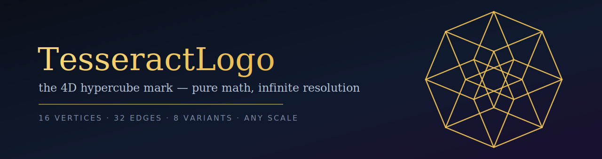
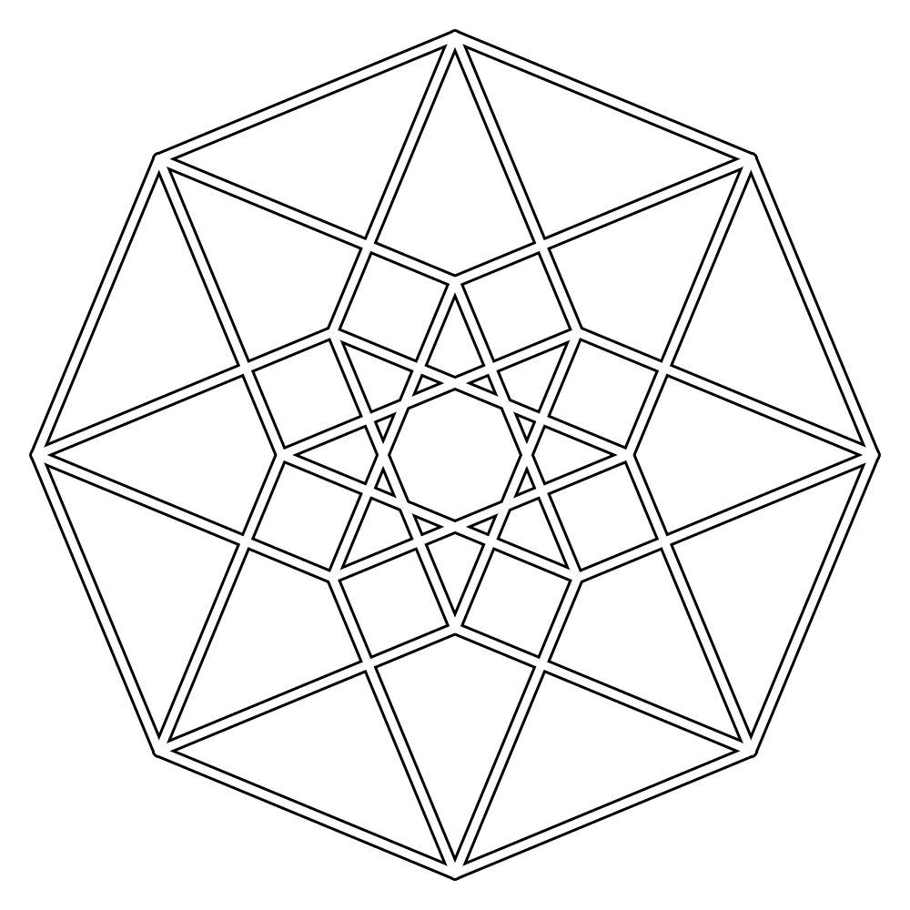
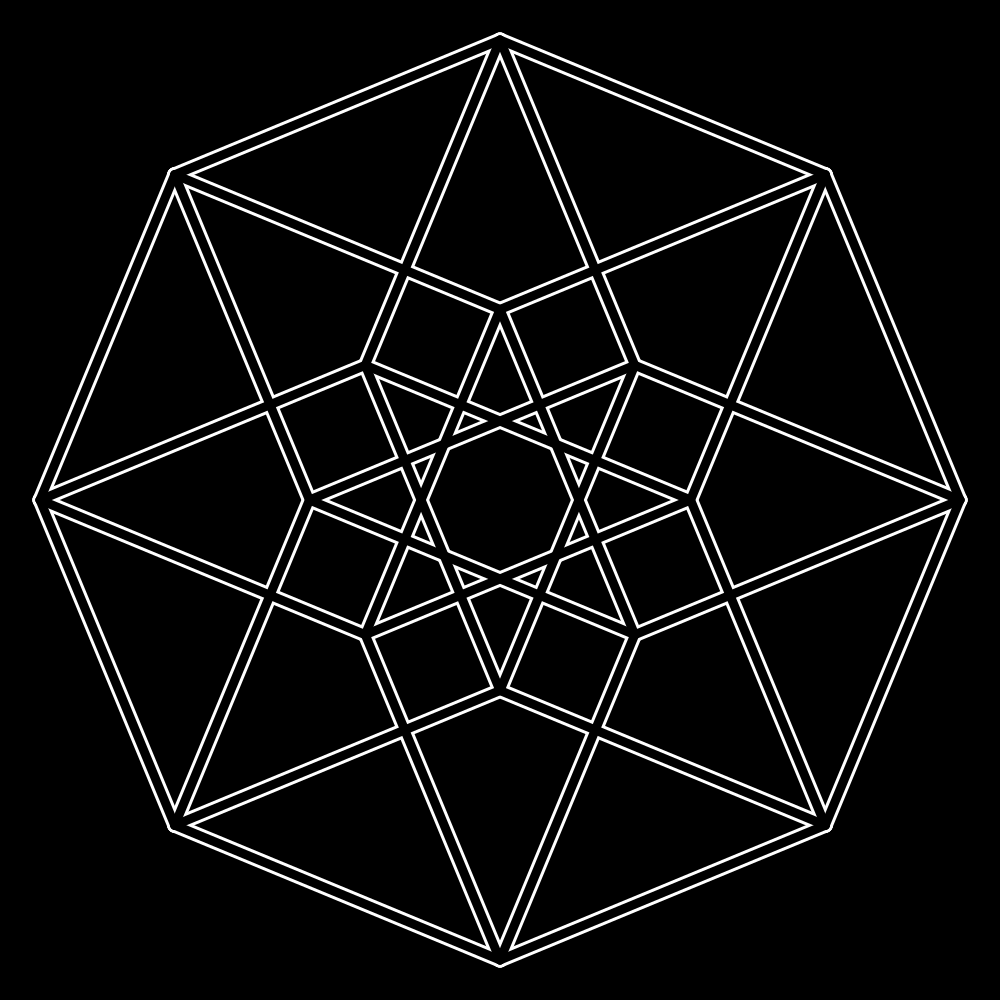
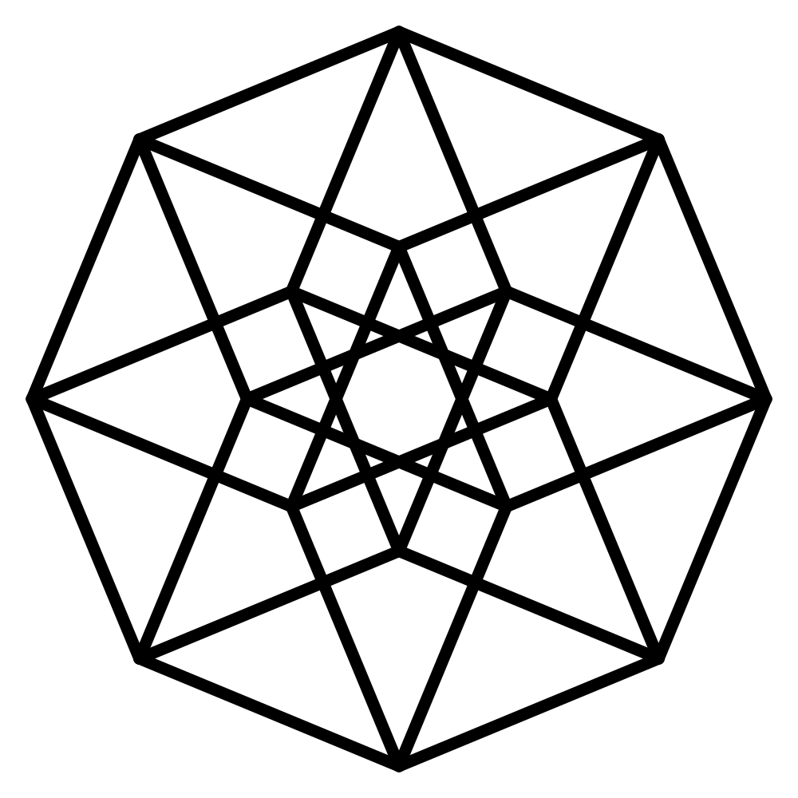
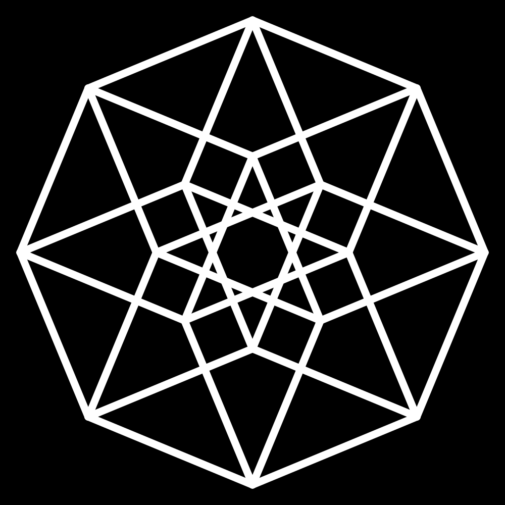
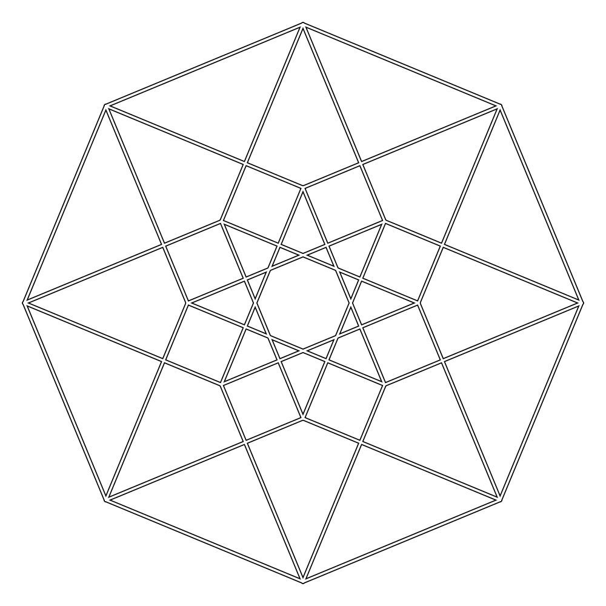
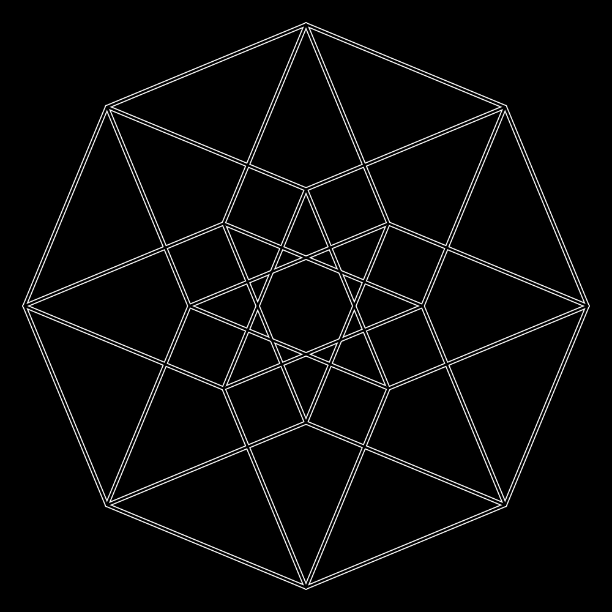
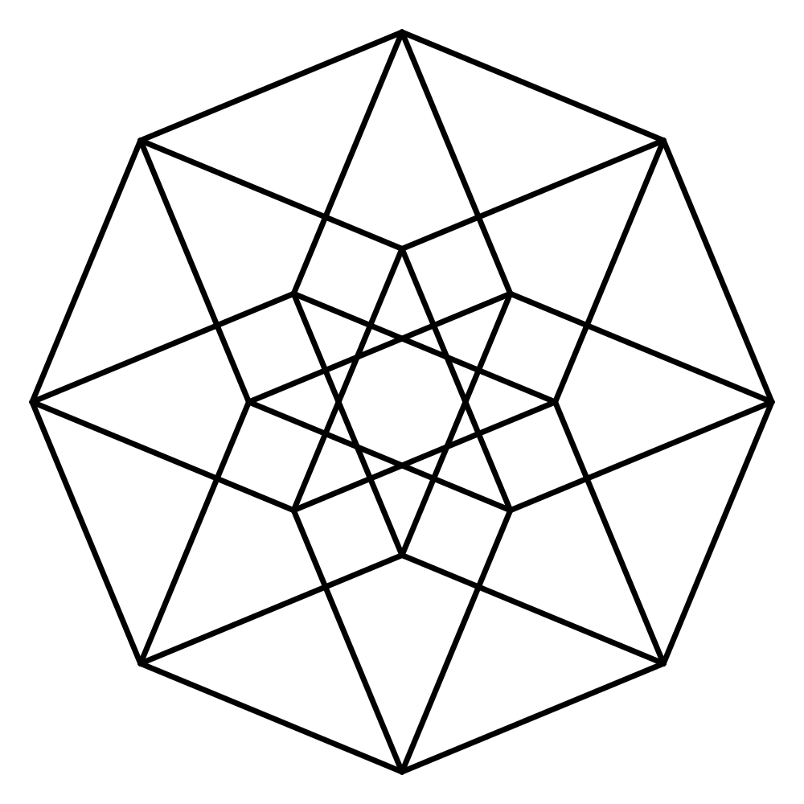
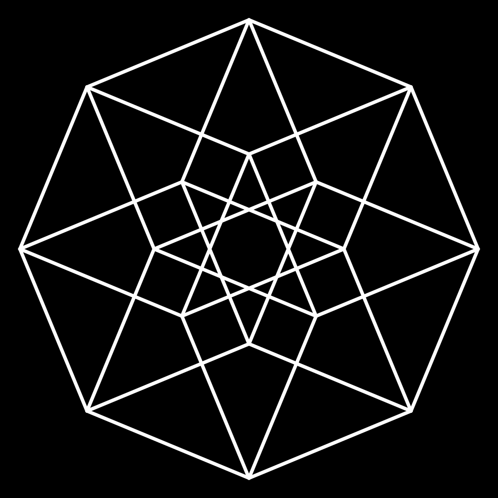
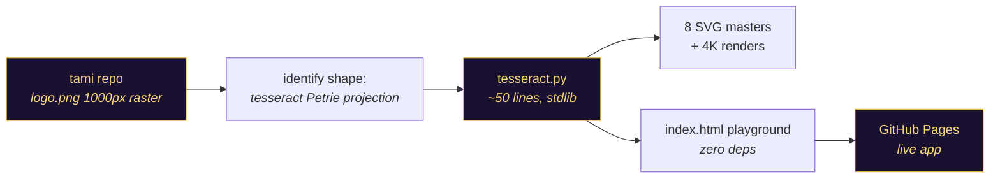

<div align="center">



[](LICENSE)
[](tesseract.py)
[](tesseract.py)
[](index.html)
[](https://tesseract.akeyo.io/)
[](https://github.com/fire17/TesseractLogo/stargazers)

<i>A logo you can zoom into forever — because it isn't a picture, it's a theorem.</i>

**[⚡ Quickstart](#-quickstart)** · **[🎨 Gallery](#-gallery--8-variants)** · **[🕹️ Playground](#%EF%B8%8F-the-playground)** · **[🧮 The math](#-the-math)** · **[🛠️ Making-of](#%EF%B8%8F-making-of)**

</div>

---

## ✨ The part that should stop you

**This mark was never drawn. It is computed.** The star-like logo from [fire17/tami](https://github.com/fire17/tami) is the *Petrie projection of a tesseract* — a real 4-dimensional hypercube flattened onto the page — and this repo regenerates it from first principles instead of upscaling the old 1000px raster:

- The **16 vertices** are every point of `(±1, ±1, ±1, ±1)` in 4D space; the **32 edges** connect pairs differing in exactly one coordinate — [`tesseract.py`](tesseract.py) `assert`s both counts on every run.
- Projection basis: angles `π/8 + i·π/4` — that's the whole trick. Four cosine/sine pairs turn 4D into the octagonal lattice you see.
- The generator is **~50 lines of Python, standard library only**. No numpy, no drawing package, no design tool.
- A vector master is **~7 KB** and stays razor sharp at any size; the original raster was 400 KB and blurry past 1000px.
- Every image in this repo — all 8 variants, the 4K renders, even the banner above — comes out of the same 32-edge computation.

> [!IMPORTANT]
> Change one number in `tesseract.py` and every variant regenerates, pixel-perfect, at any resolution — the logo is source code now.

## ⚡ Quickstart

**Zero-install:** open the live playground → **https://tesseract.akeyo.io/** — drag sliders, pick colors, hit *Save PNG*.

Or regenerate every SVG master locally (stdlib only):

```bash
git clone https://github.com/fire17/TesseractLogo && cd TesseractLogo
python3 tesseract.py            # emits all 8 SVG variants into the cwd
# optional 4K raster: brew install librsvg
rsvg-convert -w 4000 -h 4000 tesseract-outlined.svg -o tesseract-4k.png
```

## 🎨 Gallery — 8 variants

Every cell links to its infinitely-scalable SVG master; 4000×4000 PNGs live in [`assets/png/`](assets/png).

| | Light | Inverted |
|---|---|---|
| **Outlined** | [](assets/svg/tesseract-outlined.svg) | [](assets/svg/tesseract-outlined-inverted.svg) |
| **Solid** | [](assets/svg/tesseract-solid.svg) | [](assets/svg/tesseract-solid-inverted.svg) |
| **Thin outlined** | [](assets/svg/tesseract-thin-outlined.svg) | [](assets/svg/tesseract-thin-outlined-inverted.svg) |
| **Thin solid** | [](assets/svg/tesseract-thin-solid.svg) | [](assets/svg/tesseract-thin-solid-inverted.svg) |

Plus the two gray-outline masters matching the original tami style ([`tesseract.svg`](assets/svg/tesseract.svg), [`tesseract-thin.svg`](assets/svg/tesseract-thin.svg)) and the original 1000px raster for comparison in [`assets/reference/`](assets/reference).

## 🕹️ The playground

[`index.html`](index.html) — one self-contained file, zero dependencies, served as the [live GitHub Page](https://tesseract.akeyo.io/):

| Control | What it does |
|---|---|
| line width / outline thickness | bar weight; outline `0` = solid mode |
| figure scale | logo size inside the frame |
| line / outline / background colors | full pickers + transparent-background toggle |
| **Invert Colors** | flips all three to exact RGB inverses |
| **Save PNG** | canvas export at any resolution (default 4000px, up to 16k) |
| **Save SVG** | downloads the current design as a vector master |

## 🧮 The math

<details>
<summary><b>How 4 dimensions become a flat star (the whole algorithm)</b></summary>

<br>

A tesseract's vertices are all sign combinations of `(±1, ±1, ±1, ±1)`. To flatten 4D → 2D, project each vertex onto two axes built from four angles:

```python
TH = [pi/8 + i*pi/4 for i in range(4)]        # 22.5°, 67.5°, 112.5°, 157.5°
U  = [(cos(t), sin(t)) for t in TH]           # four 2D direction vectors

x = sum(v[i] * U[i][0] for i in range(4))     # vertex v = (±1,±1,±1,±1)
y = sum(v[i] * U[i][1] for i in range(4))
```

This is the **Petrie projection** — the one that gives the hypercube its maximal octagonal symmetry. The `π/8` offset rotates the octagon so corners sit at N/E/S/W, matching the original logo's orientation. Edges connect vertex pairs at Hamming distance 1 (`sum(a[i] != b[i]) == 1`), giving exactly `16·4/2 = 32` lines.

The outlined look is two stroke passes: every edge drawn wide in the outline color, then again narrower in the fill color on top.

</details>

## 🛠️ Making-of

Built in one Claude Code session (2026-07-11), driven by [fire17](https://github.com/fire17):



| Tool | Role |
|---|---|
| Python 3 stdlib (`math`, `itertools`) | all geometry — no other libraries |
| `rsvg-convert` | SVG → 4K PNG rasters |
| vanilla HTML/JS/SVG | the playground — no framework, no build step |
| Claude Code (Fable 5) | wrote the generator, app, and this page |

**Defects the process caught along the way** — kept here because honesty reads better than polish:

- First "inverted" pass used literal RGB negation on the gray-era renders — mid-gray inverts to nearly the same mid-gray, so the result barely changed. Superseded by regenerating pure black/white from vector.
- The original raster couldn't be sharpened by upscaling (soft shadows baked in at 1000px) — that failure is *why* the math reconstruction exists.

## 🛡️ Safety & undo

| | |
|---|---|
| Install footprint | none — clone and open; the app is one HTML file |
| Generator writes | SVG files into the current directory only |
| Uninstall | delete the folder |

## ⭐ If the geometry stopped you

This repo's whole thesis is that a mark built from a theorem beats a mark built from pixels. If a logo that is *literally a 4-dimensional object* earns a place in your head, a star tells the algorithm the math was worth it.

[](https://star-history.com/#fire17/TesseractLogo&Date)

## 🔗 Kin

- [fire17/tami](https://github.com/fire17/tami) — where the original mark lives.

## 📄 License

[MIT](LICENSE) © fire17

---

<div align="center">
<sub><i>16 vertices. 32 edges. One theorem, any resolution.</i></sub>
</div>
